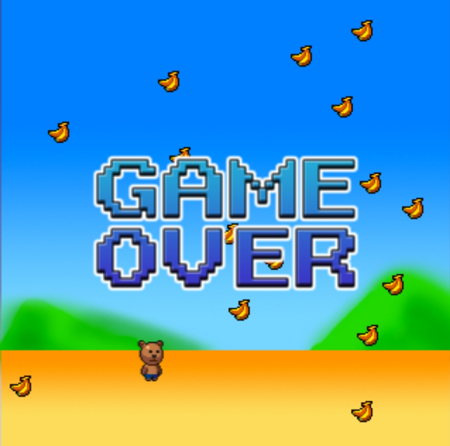

# Get Banana

## Introduction

Get Banana is a game where you control a monkey to collect bananas. The game is developed using the library enchant.js. The game is developed as a part of the lib code examples.

## How to play

Use the mouse click to move the monkey. Collect as many bananas as you can. Avoid the bombs.

## How to run

To run the game, you need to have the enchant.js library. You can download the library from [here](https://www.javascripting.com/view/enchant-js). After downloading the library, you can run the game by opening the index.html file in a browser.

## Screenshot

## Author

- Código adaptado: [Professor Alexandre Montanha](https://www.linkedin.com/in/professor-montanha/)
- Autores: [Enchant.js](https://github.com/ghelia/enchant.js-builds)
